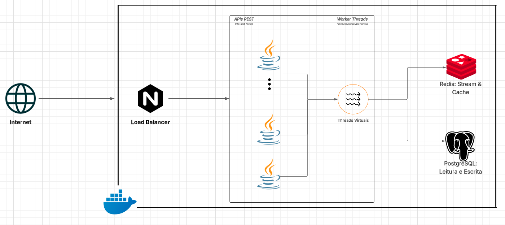

# Java 21 – Balanceamento de Carga & Threads Virtuais

Projeto desenvolvido em **Java 21 (Spring Boot)** com foco em **alta concorrência**, **processamento assíncrono** e **escalabilidade horizontal**, explorando o poder das **threads virtuais**.  
A aplicação foi projetada para suportar alta taxa de requisições por segundo, integrando banco de dados relacional e cache para otimizar latência e throughput.

---

## 🚀 Visão Geral

O projeto implementa uma **API REST** com **Spring Boot**, utilizando:
- **Threads Virtuais (Java 21 / Project Loom)** para reduzir overhead de threads nativas e melhorar concorrência.  
- **Redis (Cache Aside Pattern)** para caching eficiente e redução de consultas ao banco.  
- **Redis Streams** para **processamento assíncrono (Fire-and-Forget)**, evitando bloqueio de threads e permitindo delegação de tarefas em segundo plano.  
- **PostgreSQL** para persistência relacional e **JDBC Template** com **persistência em lote** para operações de escrita otimizadas.  
- **Docker e NGINX** para conteinerização e balanceamento de carga.  
---

## 🧩 Arquitetura do Sistema

---

## ⚙️ Testes de Carga e Métricas de Desempenho

Os testes de carga foram realizados com **Grafana K6**, monitorando métricas como **latência média** e **throughput (req/s)**.  
Essas medições foram essenciais para avaliar os ganhos proporcionados pelas threads virtuais.

### 📊 Resultados (a serem inseridos)
Aqui está a tabela atualizada com os dados extraídos da imagem que você enviou, já formatada em Markdown para colocar direto no seu **README.md** 👇

---

### 📊 Resultados de Desempenho por Algoritmo de Load Balancing

| Algoritmo de Balanceamento | Throughput (req/s) | p95 (ms) | Latência Média (ms) | Nº de Instâncias de API |
| -------------------------- | ------------------ | -------- | ------------------- | ----------------------- |
| Least Connections          | 1207.8             | 324.5    | 83.6                | 3                       |
| Least Connections          | 887.68             | 695.8    | 221.98              | 2                       |
| Round Robin                | 1060.64            | 875.6    | 136.9               | 3                       |
| Round Robin                | 921.64             | 997.56   | 203.2               | 2                       |
| IP Hash                    | 787.5              | 753.25   | 289.0               | 3                       |
| IP Hash                    | 725.0              | 913.5    | 340.0               | 2                       |

---